# task_manager

Cross Platform Application Development (Merged - SEZG585/SSZG585)(S1-23)
Assignment 1  
Flutter App with Back4App Integration

#### Assignment Description:
In this assignment, you will create a Flutter app that connects to Back4App, a Backend-as-a-Service (BaaS) platform, to manage tasks. You will be responsible for setting up the Back4App backend, creating the Flutter app, and implementing the necessary functionality to interact with the backend.

## Getting Started

### Setting up Flutter
Please follow steps on
https://docs.flutter.dev/get-started/install

Windows: https://docs.flutter.dev/get-started/install/windows  
Mac: https://docs.flutter.dev/get-started/install/macos  
Linux: https://docs.flutter.dev/get-started/install/linux  

## Running Task Manager
To run Task Manager, clone this repository. 
Open Terminal/Command Prompt to the path of this repository.  
Run the command 'flutter run'  
Then select the target device to run it on web, mobile, emulator, simulator, etc.

### Landing Screen
**Web**  
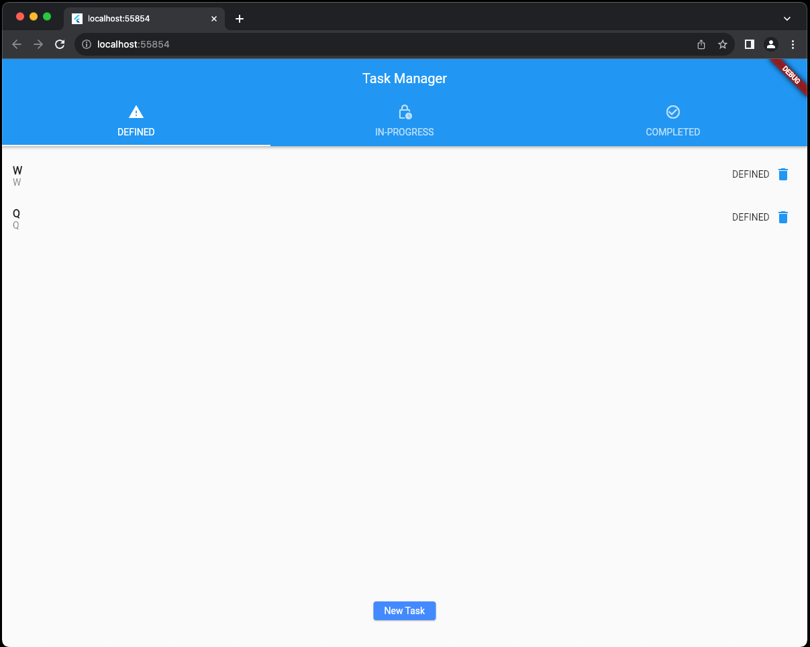

**Mobile**  
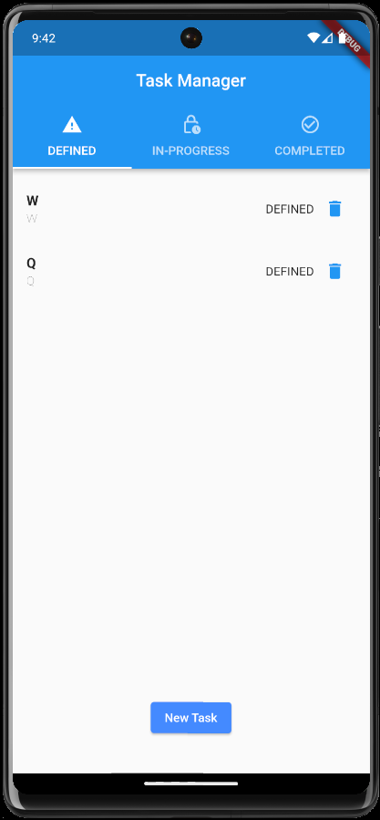

The application opens on the tab of DEFINED tasks.  
The task name can be seen in bold and its corresponding description can be seen just below it.

There are 2 other states that a task can have, IN-PROGRESS and COMPLETED which are seen in the remaining 2 tabs.
 
  <strong> IN-PROGRESS Tab </strong>  
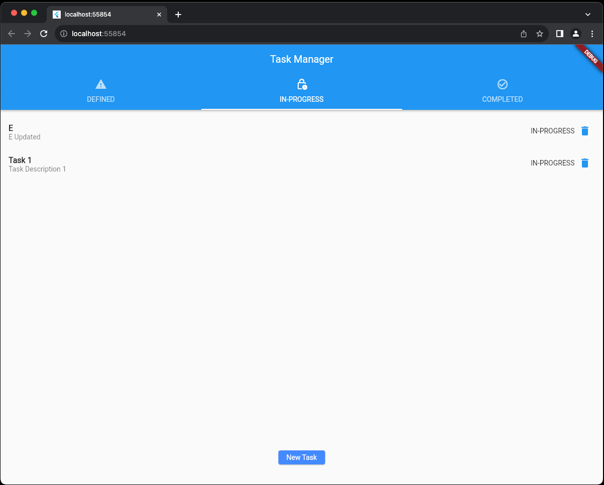

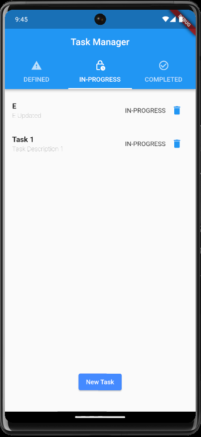

  <strong> COMPLETED Tab </strong>  
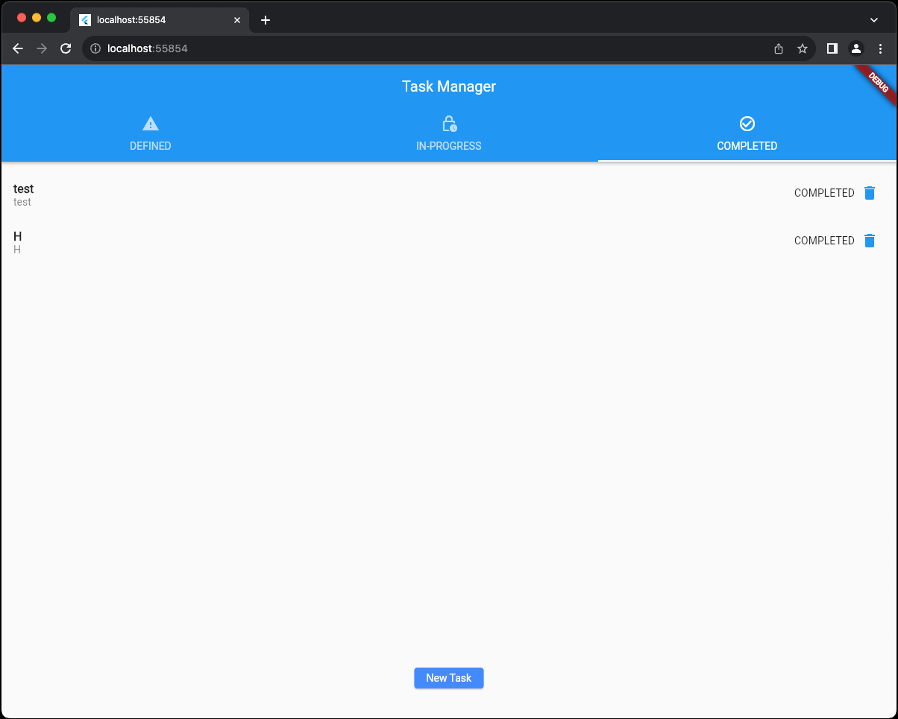

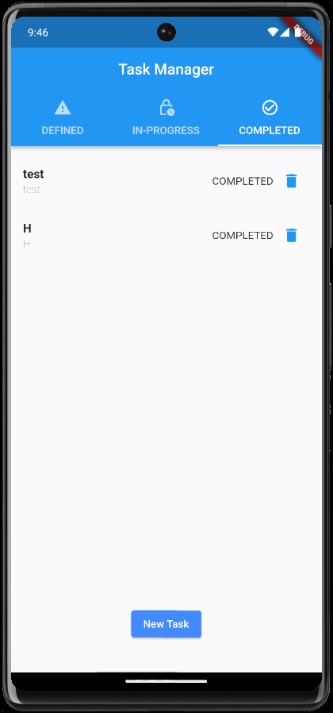
 
 

----------
#### NOTE:

The tasks in the DEFINED tab are sorted in the descending order of their creation.  
The tasks that created recently show up at the top of the screen.
 
 
The tasks in the IN-PROGRESS and COMPLETED tabs are sorted in the descending order of their modification.
The tasks that were modified recently show up at the top of the screen. 
---------

### New Task Screen
**Web**  
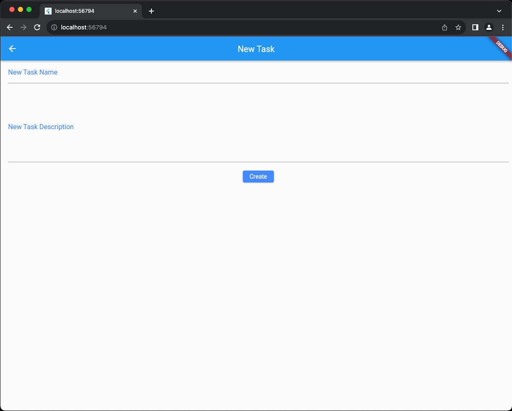

**Mobile**  
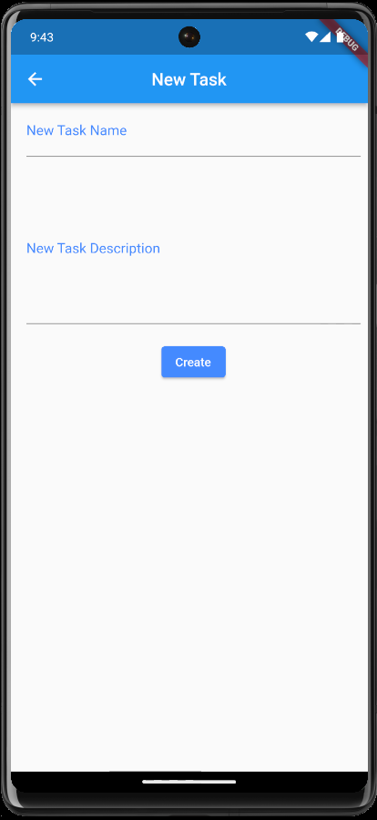

One can add a task name and a task description.  
On clicking the 'CREATE' button, the data gets saved to the Back4App database.  

**_Validation_** has been added, the task won't be created unless it has a name and a description  
The user is prompted with 'Some Data Missing' text in a snackbar at the bottom of the screen.  
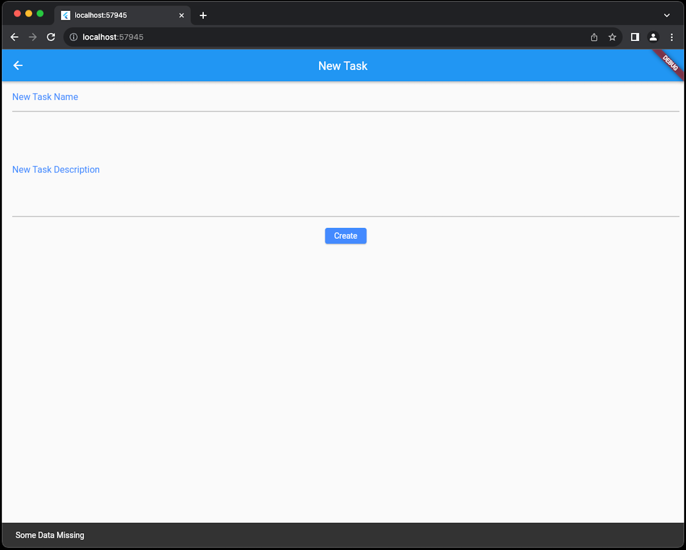

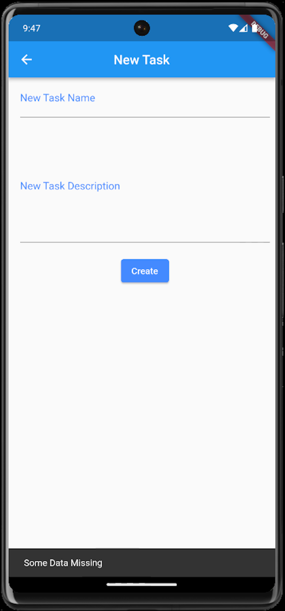

Clicking the 'CREATE' button also takes the user back to the landing screen, where the user can then view the created task under the DEFINED tab.  

### Update Task Screen
**Web**  
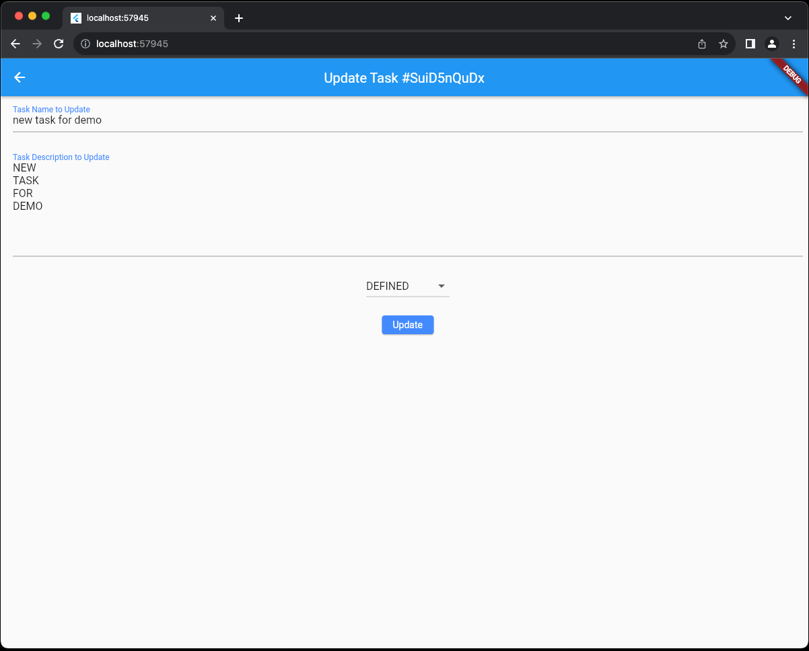

**Mobile**  
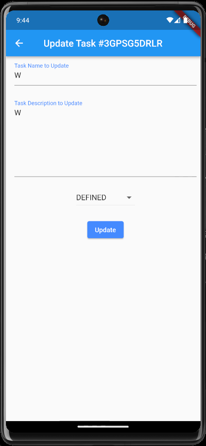

The user is presented with the task details alongwith the ID of the task he/she is editing.  
The user may edit the task name, the task description as well as the state of the task to **ONE** of the **THREE** available states, _DEFINED_, _IN-PROGRESS_ or _COMPLETED_  

States:
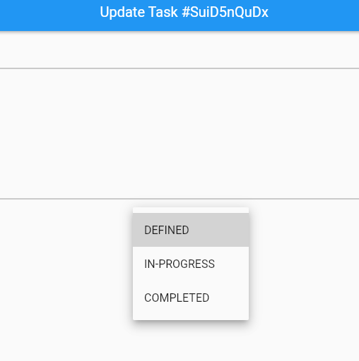

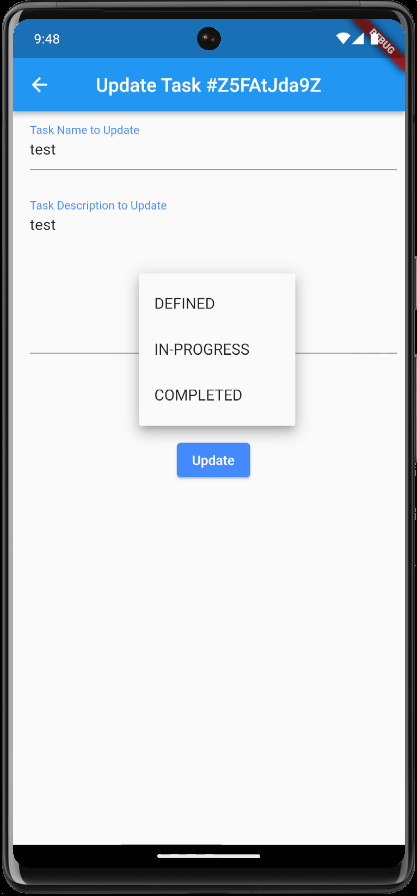

Similar **_validations_** are in place when editing the task. 
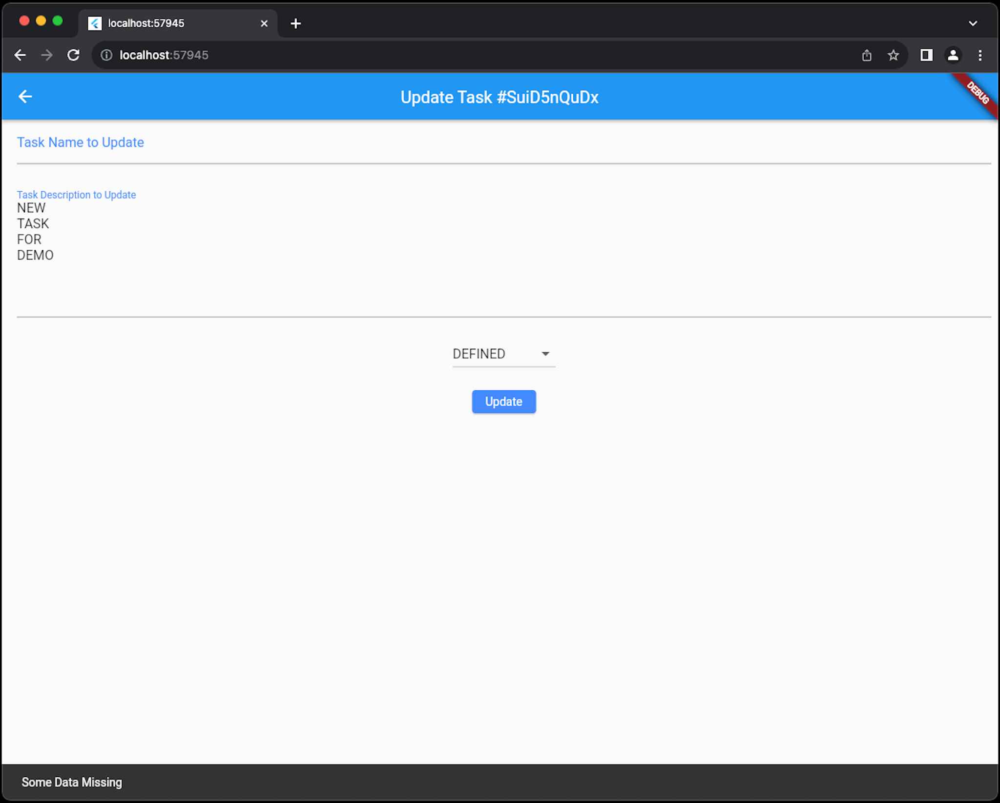

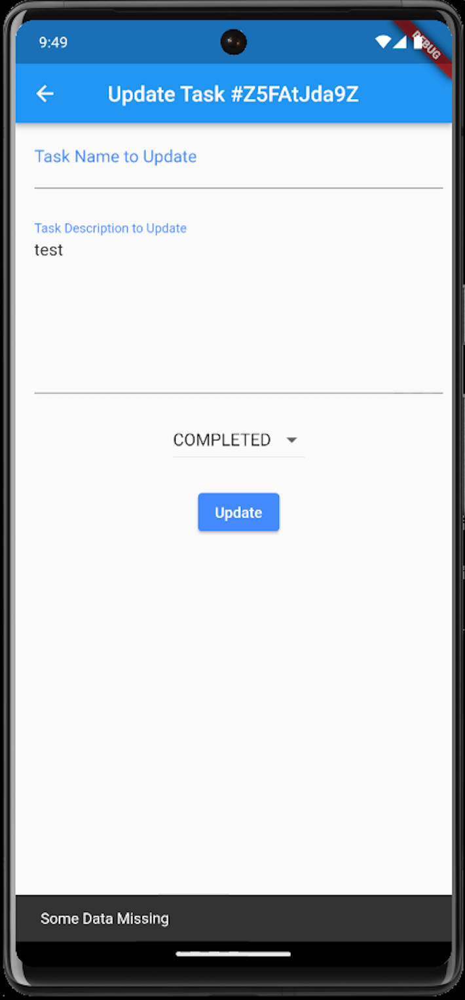

On clicking the 'UPDATE' button, the data is updated in the Back4App database.  
Clicking the 'UPDATE' button also takes the user back to the landing screen, where the user can then view the updated task under the respective tab.  

### Delete Task
On clicking the trash can icon next to the task name, the task gets deleted. 
The user is notified in a snackbar at the bottom of the screen with a message that contains the deleted task ID.  
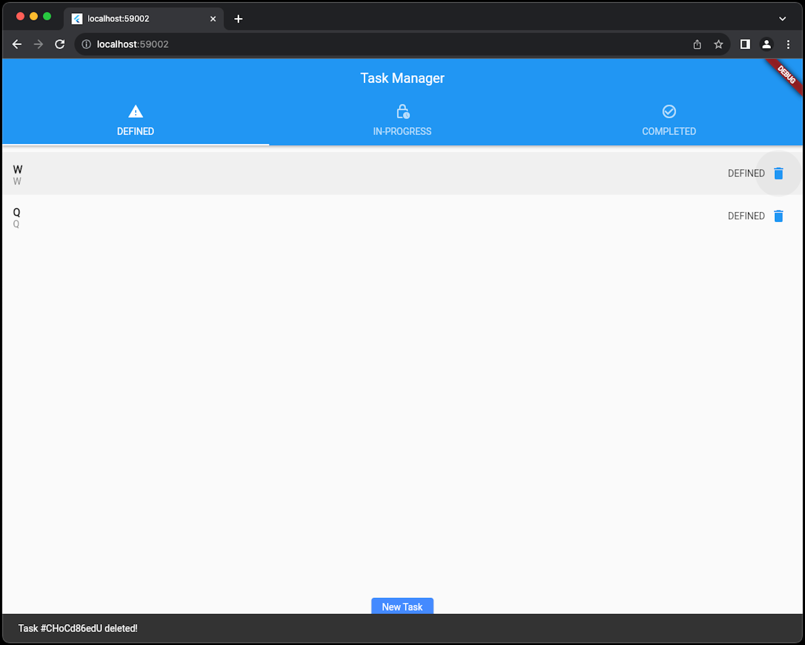

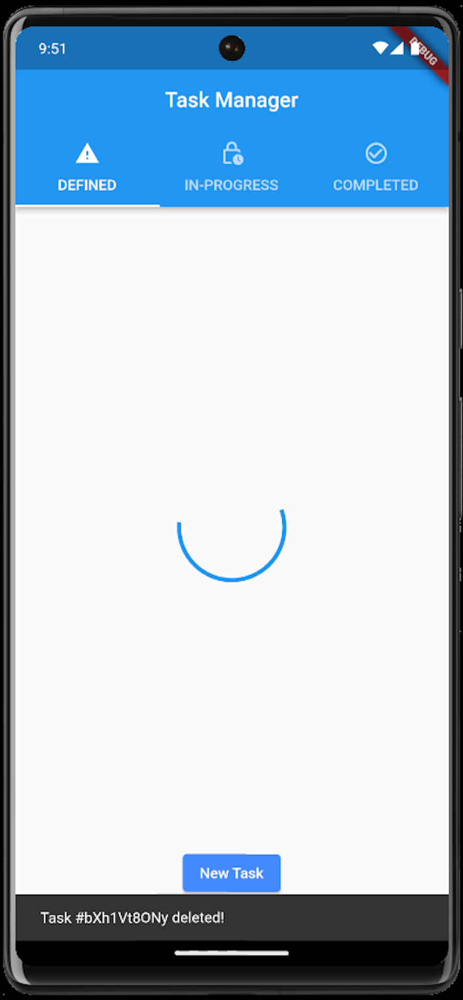

## References:
A few resources to get you started if this is your first Flutter project:

- [Lab: Write your first Flutter app](https://docs.flutter.dev/get-started/codelab)
- [Cookbook: Useful Flutter samples](https://docs.flutter.dev/cookbook)

For help getting started with Flutter development, view the
[online documentation](https://docs.flutter.dev/), which offers tutorials,
samples, guidance on mobile development, and a full API reference.
